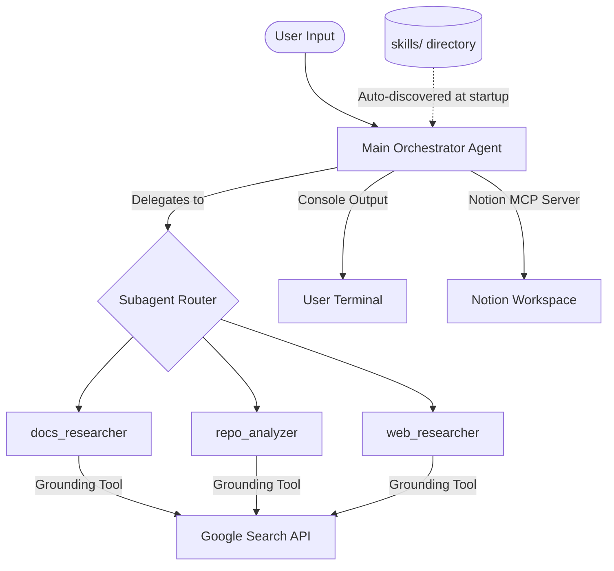
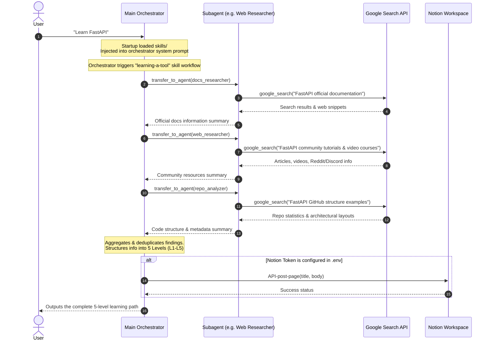

# Agent Skills — End-to-End Flow & Feature Documentation

This document provides a comprehensive overview of the **Agent Skills** project, detailing its architecture, components, features, step-by-step user flows, and verification instructions.

---

## 🗺️ System Architecture Overview

The **Agent Skills** system is a multi-agent research framework built using the **Google ADK (Agent Development Kit)** and the **Gemini 2.5 Flash** model. It enables a main orchestrator to dynamic-load task-specific instructions (Skills), delegate specialized queries to subagents, and write structured results back to Notion via MCP (Model Context Protocol).



---

## 🛠️ Feature Directory

### 1. Main Orchestrator (`orchestrator`)
*   **File location**: [agent.py](file:///c:/Users/susmi/OneDrive/Desktop/Agent_Skills/src/agent_skills/agent.py)
*   **Prompt configuration**: [main_agent.md](file:///c:/Users/susmi/OneDrive/Desktop/Agent_Skills/prompts/main_agent.md)
*   **Role**: Analyzes user input, decides whether to activate a matching "Skill", routes queries to the corresponding subagents, and synthesizes the findings into a unified, formatted final report.

### 2. Specialized Subagents
All subagents are defined and initialized in [subagents.py](file:///c:/Users/susmi/OneDrive/Desktop/Agent_Skills/src/agent_skills/subagents.py). They leverage Gemini 2.5 Flash grounded with the Google Search tool (`google_search`).

| Subagent Name | System Prompt | Capability / Focus |
| :--- | :--- | :--- |
| **`docs_researcher`** | [docs_researcher.md](file:///c:/Users/susmi/OneDrive/Desktop/Agent_Skills/prompts/docs_researcher.md) | Finds and extracts facts, APIs, guidelines, and setup steps from official documentation sites. |
| **`repo_analyzer`** | [repo_analyzer.md](file:///c:/Users/susmi/OneDrive/Desktop/Agent_Skills/prompts/repo_analyzer.md) | Analyzes code repository structures, code style, setup configurations, and examples. |
| **`web_researcher`** | [web_researcher.md](file:///c:/Users/susmi/OneDrive/Desktop/Agent_Skills/prompts/web_researcher.md) | Gathers community articles, tutorials, video courses, comparisons, and common developer gotchas. |

> [!NOTE]
> **API Grounding Limit Resolution:** In ADK, mixing model-defined peer transfers with built-in grounding search can trigger Gemini API schema violations. The subagents resolve this by setting `disallow_transfer_to_parent=True` and `disallow_transfer_to_peers=True`, and bypassing the multi-tool limit via `google_search.bypass_multi_tools_limit = True`.

### 3. Dynamic Skill Loading System
*   **Source Folder**: `skills/` (e.g., [learning-a-tool](file:///c:/Users/susmi/OneDrive/Desktop/Agent_Skills/skills/learning-a-tool))
*   **How it works**: At startup, `agent.py` automatically scans the `skills/` directory for any subfolders containing a `SKILL.md` file. It extracts the YAML frontmatter (name, description, triggers) and markdown instructions, and appends them to the orchestrator's system instruction.
*   **Example Skill (`learning-a-tool`)**:
    *   **Trigger**: Words like "learn X", "get started with X".
    *   **Workflow**: Directs the orchestrator to execute Phase 1 (Research via subagents), Phase 2 (Structure using the [progressive-learning.md](file:///c:/Users/susmi/OneDrive/Desktop/Agent_Skills/skills/learning-a-tool/references/progressive-learning.md) 5-level structure), and Phase 3 (Output generation).

### 4. Notion MCP Integration
*   **File location**: [agent.py](file:///c:/Users/susmi/OneDrive/Desktop/Agent_Skills/src/agent_skills/agent.py#L70-L95)
*   **How it works**: Uses the official Model Context Protocol (MCP) to spawn the Node-based `@notionhq/notion-mcp-server` server as a subprocess via standard input/output (`stdio`).
*   **Notion Credentials**: Set in `.env` under `NOTION_TOKEN`.
*   **Capabilities**: Allows the orchestrator to call tools such as `API-post-page` or `API-patch-block` to save the researched markdown guides directly into the user's Notion workspace.

---

## 🔄 End-to-End User Flow

When a user interacts with the system, the execution flow proceeds as follows:



---

## 🚀 How to Run & Verify the Features

Follow these verification routines to ensure each component works perfectly.

### Step 1: Verification Environment Setup

Before running tests, ensure your virtual environment is active and libraries are up to date:
```powershell
# Create & Activate Virtual Environment
python -m venv .venv
.venv\Scripts\Activate.ps1

# Install requirements
pip install -r requirements.txt
```

Verify your environment configuration in [.env](file:///c:/Users/susmi/OneDrive/Desktop/Agent_Skills/.env):
```env
GEMINI_API_KEY=your_google_studio_key
NOTION_TOKEN=your_notion_token # Optional
```

---

### Step 2: Verification of Core API Connection
Verify that the Gemini API is reachable and authenticates correctly.

*   **Command**:
    ```powershell
    .venv\Scripts\python.exe tests/test_gemini.py
    ```
*   **Successful Output Verification**:
    ```
    Connecting to Gemini API...
    Sending test prompt...

    Response received!
    ------------------------------------------------------------
    Hello! ... [Returns greeting and facts about multi-agent systems]
    ------------------------------------------------------------
    ```

---

### Step 3: Verification of Multi-Agent Orchestration
Verify that the main orchestrator can launch, route queries, transfer to subagents, and compile the final response.

*   **Command**:
    ```powershell
    .venv\Scripts\python.exe tests/test_agent.py
    ```
*   **Successful Output Verification**:
    *   Creates 3 subagents: `['docs_researcher', 'repo_analyzer', 'web_researcher']`
    *   Prints a event trace indicating a tool call to `transfer_to_agent` with input `{'agent_name': 'docs_researcher'}`.
    *   Outputs a final structured explanation of FastAPI.
    *   Prints `[PASS] Orchestrator produced a final response.`

---

### Step 4: Verification of Skill Injection & Execution
Verify that the `skills/` directories are parsed correctly and that the matching skill triggers the proper multi-subagent research phases.

*   **Command**:
    ```powershell
    .venv\Scripts\python.exe tests/test_skill.py
    ```
*   **Successful Output Verification**:
    *   Prints `Skills loaded: ['learning-a-tool']`
    *   Tracks agent events showing `transfer_to_agent` calls to the subagents in series or parallel.
    *   Outputs the progressive 5 levels:
        1. *Level 1: Overview & Motivation*
        2. *Level 2: Installation & Hello World*
        3. *Level 3: Core Concepts*
        4. *Level 4: Practical Patterns*
        5. *Level 5: Next Steps*
    *   Prints `[PASS] Skill test complete — orchestrator produced final response.`

---

### Step 5: Verification of Notion MCP integration
Verify that the Model Context Protocol (MCP) successfully boots the external Notion server and interfaces with your Notion page.

*   **Prerequisites**: Ensure you have created a Notion Integration, shared a parent page with it, and placed the Integration Secret (`NOTION_TOKEN`) in `.env`. Node.js must be installed globally.
*   **Command**:
    ```powershell
    .venv\Scripts\python.exe tests/test_notion.py
    ```
*   **Successful Output Verification**:
    *   Triggers MCP connection using `npx -y @notionhq/notion-mcp-server` under the hood.
    *   Orchestrator invokes the `API-post-page` tool.
    *   Outputs `[PASS] Notion MCP smoke test complete.`
    *   *Manual check*: Open your Notion workspace; you should see a new subpage titled **"Agent Skills - Smoke Test"** containing `"Day 2 smoke test passed. Notion MCP is connected and working."`

---

## 💡 Troubleshooting & Common Issues

1. **`503 UNAVAILABLE` Server Error**:
   *   *Cause*: Google Gemini API is experiencing a high volume of requests on the free tier.
   *   *Solution*: Wait a few minutes and re-run the command. The error is transient.
2. **Missing `NOTION_TOKEN` Warnings**:
   *   *Cause*: System did not find a Notion credentials key.
   *   *Solution*: The application gracefully defaults to terminal-only output. If you want Notion writes, verify your `.env` formatting.
3. **`npx` not found**:
   *   *Cause*: Node.js is not installed or not in the system's `PATH`.
   *   *Solution*: Install Node.js from [nodejs.org](https://nodejs.org/). Restart your terminal and check with `node -v` and `npx -v`.
